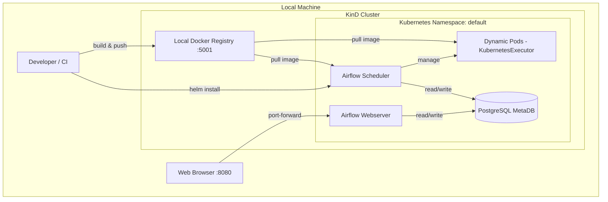

# Project Architecture

This project provides a local development environment for running Apache Airflow on Kubernetes using KinD (Kubernetes in Docker).

## System Overview

The following diagram illustrates how the components interact:

## Key Components

### 1. KinD (Kubernetes in Docker)
KinD is used to spin up a multi-node Kubernetes cluster locally using Docker containers as nodes. This allows for a realistic Kubernetes environment without the overhead of a full cloud provider.

### 2. Local Docker Registry
A local registry is deployed alongside the KinD cluster. This is crucial for development because it allows you to build custom Airflow images (containing your DAGs) and push them to a location where the KinD nodes can pull them from.

### 3. Apache Airflow
- **Webserver**: Provides the UI for managing and monitoring DAGs.
- **Scheduler**: Handles the scheduling of tasks and interacts with the Kubernetes API to launch pods.
- **PostgreSQL**: Serves as the metadata database for Airflow.

### 4. KubernetesExecutor
Unlike the LocalExecutor or CeleryExecutor, the **KubernetesExecutor** spins up a new Pod for *every single task* instance. This provides:
- **Isolation**: Each task runs in its own environment.
- **Scalability**: Tasks can scale up to the limits of the cluster.
- **Customization**: Different tasks can use different Docker images or resource requirements.

## Deployment Workflow

1. **Initialize Cluster**: Use `kind_cluster/create_cluster_with_registry.sh`.
2. **Build Image**: Build a Docker image containing your DAGs from the `airflow-dags/` directory.
3. **Push Image**: Tag and push the image to `localhost:5001`.
4. **Deploy Helm**: Use the custom Helm chart in `helm-chart/` to deploy Airflow, pointing it to your custom image in the local registry.
